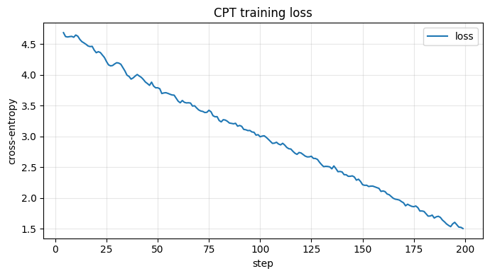
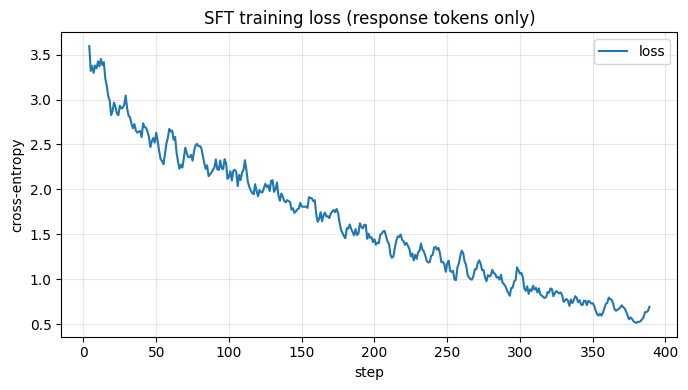
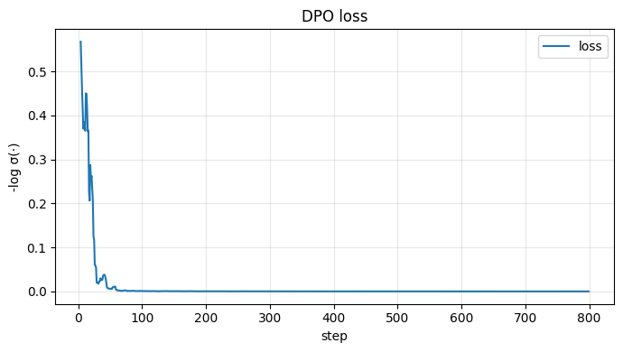
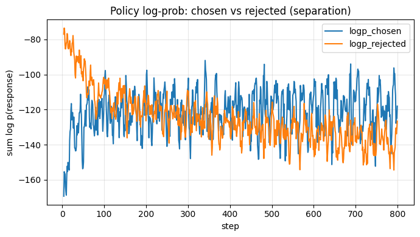
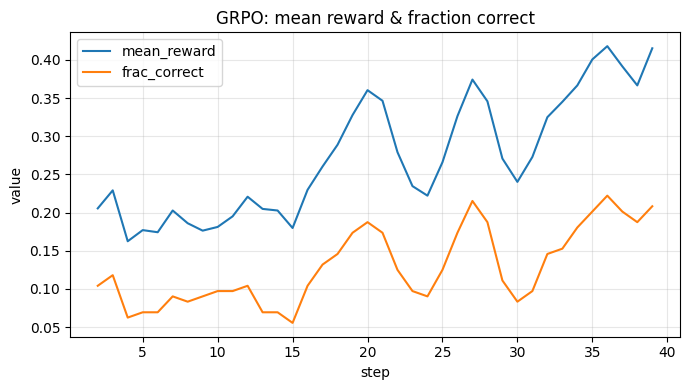

# llm-post-training-from-scratch

A didactic, **from-scratch** implementation of the four core LLM post-training
techniques — **CPT, SFT, DPO, and GRPO** — in pure PyTorch, with one Jupyter
notebook per stage.

No `trl`, no `peft`, no `unsloth`, no `bitsandbytes`. The transformer itself is
loaded with `transformers` (that part is not the point), but **every training
algorithm and even the LoRA layer is written by hand** so the "trick" of each
technique is visible in plain code.

> Goal: demonstrate deep understanding of the *mechanics* of post-training, not
> production performance. Didactic clarity matters as much as correctness.

---

## The pipeline

Each stage builds on the previous one, forming a chained pipeline. The same small
base model and the same hand-written `LoRALinear` flow all the way through.

```
                 ┌─────────────────────────────────────────────────────────┐
   Base model    │  HuggingFaceTB/SmolLM2-135M  (frozen weights + LoRA)      │
 (pretrained)    └─────────────────────────────────────────────────────────┘
        │
        ▼
  ┌───────────┐     ┌───────────┐     ┌───────────┐     ┌───────────┐
  │  01 CPT   │ ──▶ │  02 SFT   │ ──▶ │  03 DPO   │ ──▶ │  04 GRPO  │
  │ raw text  │     │ prompt→   │     │ chosen vs │     │ verifiable│
  │ next-tok  │     │ response  │     │ rejected  │     │ reward RL │
  └───────────┘     └───────────┘     └───────────┘     └───────────┘
   absorb domain     learn to follow   align to human    improve reasoning
   vocabulary        instructions      preferences       via rewards
```

CPT → SFT → DPO are strictly chained (each loads the previous adapter). GRPO is
the one deliberate exception: it starts from the **base model**, because its
arithmetic task is unrelated to the domain the earlier stages specialized in (more
on this below).

---

## Comparison of the four techniques

| Technique | What it teaches | Data format | Loss / objective | When to use |
|-----------|-----------------|-------------|------------------|-------------|
| **CPT**  | New domain knowledge & vocabulary | Raw text (no structure) | Causal LM loss on **all** tokens | Adapt a base model to a new domain/corpus |
| **SFT**  | Instruction following, output format | `(prompt, response)` pairs | Causal LM loss **masked to response** tokens | Turn a base model into a helpful assistant |
| **DPO**  | Preference alignment | `(prompt, chosen, rejected)` triples | `-log σ(β·[(πθ−πref)_chosen − (πθ−πref)_rejected])` | Cheap RLHF-style alignment, no reward model |
| **GRPO** | Reasoning toward a verifiable goal | Prompts + a **reward function** | Clipped policy gradient with **group-normalized advantage** + KL | Tasks with a checkable reward (math, code, etc.) |

Three conceptual contrasts the notebooks make explicit:

- **CPT vs SFT:** identical loss function; the *only* difference is label masking.
- **DPO vs PPO/RLHF:** DPO needs **no reward model and no sampling** — a frozen
  reference model plus a logistic loss is enough.
- **GRPO vs PPO:** GRPO replaces PPO's learned **value network (critic)** with the
  **mean reward of a sampled group**, dramatically simplifying RL.

---

## Repository structure

```
llm-post-training-from-scratch/
├── README.md
├── requirements.txt
├── .gitignore
├── src/                       # all the from-scratch algorithms
│   ├── lora.py                # manual LoRALinear + injection into q_proj/v_proj
│   ├── data.py                # dataset builders for each stage + GRPO reward
│   ├── utils.py               # seeding, device, logging, checkpoints, plots
│   └── losses.py              # causal LM, DPO, GRPO advantage & policy loss
├── notebooks/
│   ├── 00_setup_and_base_model.ipynb
│   ├── 01_cpt.ipynb
│   ├── 02_sft.ipynb
│   ├── 03_dpo.ipynb
│   └── 04_grpo.ipynb
├── scripts/
│   └── smoke_test.py          # offline (no-download) sanity check of all algorithms
├── data/                      # small, versioned toy datasets (JSONL)
│   ├── cpt_corpus.jsonl       # 51 raw paragraphs about a fictional craft
│   ├── sft_pairs.jsonl        # 50 instruction→response pairs
│   └── dpo_prefs.jsonl        # 40 (prompt, chosen, rejected) triples
└── checkpoints/               # gitignored; structure documented in .gitkeep
    ├── cpt/  sft/  dpo/  grpo/ #   each holds a small adapter.pt (LoRA only)
```

### The toy domain

The CPT/SFT/DPO data is a self-contained piece of fiction — the craft of
**lumenwrighting** in the city of **Solgrove** (cultivating living light-crystals
called *lumens* from *sablecores* using *dawnglass* and *resonance-tuning*). The
domain is invented on purpose: its vocabulary is guaranteed to be absent from the
base model, which makes "vocabulary absorption" in CPT easy to *see*. GRPO instead
uses procedurally generated arithmetic, because it needs a **verifiable** reward.

---

## Quick start

### With `uv` (used to develop and verify this repo)

```bash
uv venv --python 3.12 .venv
source .venv/bin/activate
uv pip install -r requirements.txt
python scripts/smoke_test.py        # optional: verify the algorithms in ~15s
jupyter lab                         # then run notebooks/00 → 04 in order
```

### With plain `pip`

```bash
python -m venv .venv && source .venv/bin/activate
pip install -r requirements.txt
# On a CUDA machine, install the matching torch build, e.g.:
#   pip install torch==2.3.1 --index-url https://download.pytorch.org/whl/cu121
jupyter lab
```

Run the notebooks **in order** (`00` → `04`); each one loads the previous stage's
LoRA checkpoint (GRPO loads the base model by design).

> Tip: to keep the HuggingFace model download inside the project folder, set
> `export HF_HOME="$PWD/.hf"` before launching Jupyter.

### Runs anywhere

Device selection is automatic: **CUDA → Apple Metal (MPS) → CPU**. Mixed precision
(`amp_context`) uses bf16 autocast on CUDA and is a no-op on MPS/CPU, so the same
training loops run unchanged on a MacBook and on a cloud GPU. The base model is
only ~135M parameters and the trainable LoRA is ~0.46M, so **< 8 GB VRAM** (or an
Apple-Silicon Mac) is plenty.

#### RunPod (optional, for faster training)

1. **GPU:** a single A40 / RTX 4090 / A100 40GB is more than enough.
2. **Template:** any recent "PyTorch 2.x + CUDA 12.1" image.
3. Inside the pod: `pip install -r requirements.txt`, then
   `jupyter lab --ip 0.0.0.0 --allow-root --no-browser` and open the forwarded
   port.

---

## The notebooks, explained one by one

Every notebook is self-contained (it re-loads the model and imports from `src/`),
opens with the intuition and the math in markdown, then implements the stage in a
plain, readable training loop, and ends with plots / before-vs-after generations
and a saved checkpoint.

### `00_setup_and_base_model.ipynb` — foundation

**Purpose:** establish the shared starting point used by every later notebook.

- Loads `SmolLM2-135M` + tokenizer (pad token set to EOS for batching).
- Reports the parameter count (**134,515,008** params, all initially trainable).
- Generates from the **untrained** base model to establish baselines — notably it
  has no idea what a "lumenwright" is, and it doesn't cleanly follow an
  instruction. These are exactly what CPT and SFT will change.
- Injects the hand-written LoRA into the attention `q_proj` / `v_proj` of all 30
  layers (**60 `LoRALinear` modules**), freezing the base weights. Only
  **~460,800 params (0.341%)** remain trainable.
- **Sanity check:** with `B = 0` the LoRA-wrapped model is mathematically
  identical to the base model (max logit difference `0.00e+00`), and nudging a `B`
  matrix changes the output — proving the adapter is wired in correctly.

**Take-away:** LoRA = frozen base + a tiny trainable low-rank residual
`(α/r)·B·A`, initialized as a no-op.

### `01_cpt.ipynb` — Continued Pre-Training

**Purpose:** inject new *knowledge* by continuing pre-training on raw domain text.

- **Idea:** CPT is just pre-training, continued — the same next-token loss
  `L = -Σ log p(xₜ | x₍<ₜ₎)`, computed over **every** token (`labels == input_ids`,
  nothing is masked). Discusses catastrophic forgetting and its mitigations (LoRA,
  low LR, replay).
- Builds `CPTDataset` from `data/cpt_corpus.jsonl` (packs the corpus into
  fixed-length 128-token blocks) and a from-scratch loop with `causal_lm_loss`.
- **What to watch:** the loss curve and the **before-vs-after generations** — the
  model starts continuing prompts with generic text and ends using the invented
  vocabulary (lumenkeeper, dawnkeeper, Accord…).
- Saves `checkpoints/cpt/adapter.pt`.

**Observed result:** loss `4.78 → 1.72`; clear vocabulary absorption.

### `02_sft.ipynb` — Supervised Fine-Tuning

**Purpose:** teach the model to *follow instructions*, reusing CPT's knowledge.

- **Idea:** the *exact same* loss as CPT, but the loss is **masked to response
  tokens only** — every prompt-token label is set to `-100` (`cross_entropy`'s
  `ignore_index`). The notebook prints a `labels` tensor so the `-100` mask is
  literally visible token-by-token.
- Loads the CPT adapter, builds `SFTDataset` from `data/sft_pairs.jsonl`, and
  right-pads batches with `pad_collate` (padding labels with `-100` too).
- **What to watch:** before (post-CPT) the model rambles/continues the prompt;
  after SFT it answers the instruction directly in the `### Response:` format.
- Saves `checkpoints/sft/adapter.pt`.

**Observed result:** response-only loss ≈ `0.85`; instruction-following behavior.

### `03_dpo.ipynb` — Direct Preference Optimization

**Purpose:** align to preferences from `(prompt, chosen, rejected)` triples,
**without** a reward model.

- **Idea:** the implicit reward of a response is a scaled log-ratio between the
  policy and a frozen reference, `r(x,y) = β·(log πθ(y|x) − log π_ref(y|x))`.
  Plugging it into a Bradley–Terry model yields the DPO logistic loss. No reward
  model, no sampling — only *scoring* given responses.
- Keeps a **frozen copy** of the SFT model as the reference; the policy also starts
  from SFT. Walks through `sequence_logprobs` step by step (shift → log-softmax →
  gather → mask → sum) and shows the margin is ~0 at init (policy ≡ reference).
- Trains with `dpo_loss` and logs loss, preference accuracy, and the policy's
  `logp_chosen` vs `logp_rejected`.
- **What to watch:** the signature DPO plot — the **separation** between chosen and
  rejected log-probs growing over training.
- Saves `checkpoints/dpo/adapter.pt`.

**Observed result:** chosen/rejected margin `0 → ~10`, preference accuracy `1.0`;
answers shift toward the on-tone "chosen" style.

### `04_grpo.ipynb` — Group Relative Policy Optimization

**Purpose:** improve reasoning with real RL on a task that has a **verifiable**
reward (arithmetic), implemented from scratch.

- **Idea:** PPO needs a learned value network for the advantage baseline. GRPO's
  trick: sample a **group** of `G` responses per prompt and use the **group mean**
  as the baseline — `Aᵢ = (rᵢ − mean(r)) / (std(r) + ε)` — eliminating the critic.
  The policy is then updated with a PPO-style **clipped** surrogate plus a **KL
  penalty** to a frozen reference.
- **Verifiable reward** (`arithmetic_reward`, deterministic and graded so a weak
  model gets a usable gradient): `+0.1` reasoning tags, `+0.2` answer tags, `+0.1`
  for a parseable integer, **`+1.0` for the correct number** (max `1.4`).
- **From scratch:** group generation (temperature sampling), reward scoring, a
  completion mask, group-normalized advantage, and the clipped PG + KL objective.
- **Two deliberate choices for a 135M model** (explained in the notebook):
  1. **Start from the base model**, not the DPO/SFT adapter — the lumen
     specialization is irrelevant (and harmful) for arithmetic.
  2. **One-shot prompt** — a single worked example makes the answer format appear
     often enough (with sampling variance) to give GRPO a signal. Empirically,
     one-shot ≫ zero- or two-shot for this model.
- **What to watch:** mean group reward and fraction-correct rising; final greedy
  generations producing the `<reasoning>/<answer>` format and solving easy sums.
- Saves `checkpoints/grpo/adapter.pt`.

**Observed result:** mean reward `0.15 → 0.50`, fraction correct `0.04 → 0.25`
over 40 steps; the final model reliably emits the format and gets several sums
right (e.g. `4 + 9 = 13`, `4 + 6 = 10`).

---

## Results

All figures below are the actual outputs of the committed notebooks, executed
end-to-end on an Apple-Silicon MacBook (Metal/MPS). They are the clearest evidence
that each from-scratch algorithm behaves the way the theory predicts.

### CPT — the loss falls as domain vocabulary is absorbed

Next-token loss over **all** tokens drops steadily as the model memorizes the
invented lumenwrighting corpus.



### SFT — same loss, but masked to response tokens

Identical causal-LM objective as CPT, now computed **only on response tokens**; the
model learns to answer in the `### Response:` format.



### DPO — chosen and rejected log-probs separate

The signature DPO result: starting from a margin of ~0 (policy ≡ reference), the
policy pushes **chosen** responses up and **rejected** responses down. The loss
`-log σ(·)` collapses to ~0 as preference accuracy reaches `1.0`.





### GRPO — mean group reward and fraction-correct rise

With a critic-free, group-normalized advantage and a verifiable arithmetic reward,
the mean group reward and the fraction of correct answers both climb over training.



---

## The `src/` library

All algorithms live here so the notebooks stay focused on orchestration + teaching.

- **`lora.py`** — `LoRALinear` (frozen base + `(α/r)·B·A`, `B=0` at init),
  `inject_lora` (freezes the model and swaps target `nn.Linear`s),
  `lora_parameters` / `lora_state_dict` / `load_lora_state_dict`,
  `count_parameters`.
- **`losses.py`** — `causal_lm_loss`, `sequence_logprobs`, `dpo_loss`,
  `group_normalized_advantage`, `grpo_policy_loss`, `per_token_logprobs`. Each
  carries a `# HERE:` comment marking the algorithm's central idea and cites the
  source paper.
- **`data.py`** — `format_prompt`, `CPTDataset`, `SFTDataset`, `DPODataset`,
  `pad_collate`, and the GRPO task: `ArithmeticProblem`,
  `generate_arithmetic_problems`, `extract_answer`, `arithmetic_reward`.
- **`utils.py`** — `set_seed`, `get_device`, `autocast_dtype`, `amp_context`,
  `LossLogger`, `plot_curves`, `save_lora_checkpoint` / `load_lora_checkpoint`,
  `read_jsonl` / `write_jsonl`.

`scripts/smoke_test.py` exercises LoRA, every loss, the datasets, and one training
step per stage on a tiny throwaway model — **no model download required** — and is
a fast way to confirm the algorithms are intact after any edit.

---

## Design choices

- **Manual LoRA** on `q_proj` / `v_proj`, base weights frozen; checkpoints store
  **only** the LoRA factors (a few MB each), so the chained pipeline is cheap.
- **Mixed precision** via `torch.autocast` (bf16 on Ampere+); no quantization, to
  keep the code didactic.
- **Fixed seeds** (`set_seed`) for reproducibility.
- **Tiny by design.** The datasets and step counts are intentionally small to show
  *mechanics and curves* quickly, not to produce a strong model — so the 135M
  model's generations are sometimes incoherent, which is expected.

### Approximate wall-clock per notebook

| Notebook | Apple M-series (MPS) | Single 4090 / A40 |
|----------|----------------------|-------------------|
| 00 setup | < 1 min | < 1 min |
| 01 CPT   | ~1–2 min | ~1 min |
| 02 SFT   | ~2 min | ~1–2 min |
| 03 DPO   | ~7 min | ~3 min |
| 04 GRPO  | ~20 min | ~10 min |

GRPO is the slow one because it **generates inside the training loop**
(`STEPS × NUM_PROMPTS × GROUP` samples per run).

---

## Status

Complete and verified — all five notebooks were executed end-to-end on an Apple
Silicon MacBook (Metal/MPS) and produce the pedagogical results quoted above. The
notebooks are committed **with their executed outputs and plots** so they read as a
finished tutorial.

---

## References

- LoRA — Hu et al., 2021, *LoRA: Low-Rank Adaptation of Large Language Models*
  ([arXiv:2106.09685](https://arxiv.org/abs/2106.09685)).
- DPO — Rafailov et al., 2023, *Direct Preference Optimization*
  ([arXiv:2305.18290](https://arxiv.org/abs/2305.18290)).
- GRPO — Shao et al., 2024, *DeepSeekMath*
  ([arXiv:2402.03300](https://arxiv.org/abs/2402.03300)).
- Base model — [`HuggingFaceTB/SmolLM2-135M`](https://huggingface.co/HuggingFaceTB/SmolLM2-135M).
